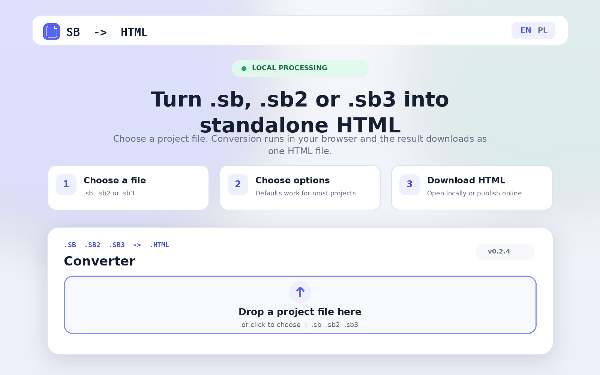
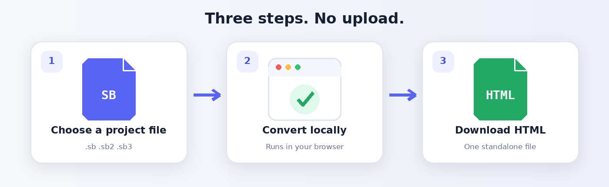
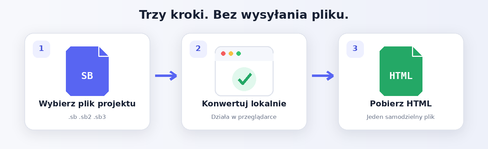

# SB to HTML Converter

<p align="center">
  <a href="https://sbtohtml.lepczynski.it">
    
  </a>
</p>

## English

Convert `.sb`, `.sb2`, and `.sb3` project files into a single HTML file that opens in a modern browser. Conversion runs locally on the user's device.

**[Open the online converter](https://sbtohtml.lepczynski.it)** · **[Download the offline version](https://github.com/lepczynski-cloud/sb-to-html-converter/releases/latest)**

<p align="center">
  
</p>

### Main features

- drag-and-drop conversion to one standalone `.html` file;
- local processing in the browser, without uploading the project to this application's server;
- optional Turbo mode, smoother motion, autoplay, player controls, fullscreen, and cloud-variable settings;
- hosted and downloadable offline versions;
- works with project files exported from Scratch.

### Use the online converter

1. Open the [online converter](https://sbtohtml.lepczynski.it).
2. Drop an `.sb`, `.sb2`, or `.sb3` file onto the page, or select it from your device.
3. Change the optional settings only when needed.
4. Select **Convert and download HTML**.

### Use it offline

Download `sb-to-html-converter.html` from the [latest GitHub release](https://github.com/lepczynski-cloud/sb-to-html-converter/releases/latest) and open it directly in a current version of Chrome, Edge, Firefox, or Safari.

You can also build the converter from source.

Requirements:

- Node.js 24 or newer
- Git
- Internet access during the first build

```bash
git clone https://github.com/lepczynski-cloud/sb-to-html-converter.git
cd sb-to-html-converter
npm install
npm run build
```

The standalone converter is generated at:

```text
dist/offline/sb-to-html-converter.html
```

To preview the hosted build locally:

```bash
npm run serve
```

Then open `http://127.0.0.1:8080`.

### Limitations and safety

- Large projects can exceed the available browser memory, especially on mobile devices.
- Custom extensions may require Internet access and run without a sandbox in the generated project.
- A generated project may connect to external services when the original project uses them.
- Only convert and publish projects for which you have the necessary rights.

### License and independence

This project is licensed under the [Mozilla Public License 2.0](LICENSE) and is based on [TurboWarp Packager](https://github.com/TurboWarp/packager). See [NOTICE](NOTICE) for attribution.

SB to HTML Converter is an independent project. It is not affiliated with or endorsed by the Scratch Foundation or TurboWarp.

---

## Polski

Konwerter zmienia pliki projektów `.sb`, `.sb2` i `.sb3` w jeden samodzielny plik HTML, który można otworzyć w nowoczesnej przeglądarce. Konwersja odbywa się lokalnie na urządzeniu użytkownika.

**[Otwórz konwerter online](https://sbtohtml.lepczynski.it)** · **[Pobierz wersję offline](https://github.com/lepczynski-cloud/sb-to-html-converter/releases/latest)**

<p align="center">
  
</p>

### Najważniejsze funkcje

- przeciąganie pliku i konwersja do jednego samodzielnego pliku `.html`;
- lokalne przetwarzanie w przeglądarce, bez wysyłania projektu na serwer tej aplikacji;
- opcjonalny tryb Turbo, płynniejszy ruch, autostart, elementy sterowania, pełny ekran i ustawienia zmiennych chmurowych;
- wersja online oraz samodzielny konwerter offline;
- obsługa plików projektów wyeksportowanych z edytora Scratch.

### Użycie wersji online

1. Otwórz [konwerter online](https://sbtohtml.lepczynski.it).
2. Przeciągnij plik `.sb`, `.sb2` lub `.sb3` na stronę albo wybierz go z urządzenia.
3. Zmień ustawienia opcjonalne tylko wtedy, gdy są potrzebne.
4. Wybierz **Konwertuj i pobierz HTML**.

### Użycie offline

Pobierz `sb-to-html-converter.html` z [najnowszego wydania na GitHubie](https://github.com/lepczynski-cloud/sb-to-html-converter/releases/latest), a następnie otwórz go bezpośrednio w aktualnej wersji Chrome, Edge, Firefox lub Safari.

Konwerter można również zbudować ze źródeł.

Wymagania:

- Node.js 24 lub nowszy
- Git
- dostęp do Internetu podczas pierwszego buildu

```bash
git clone https://github.com/lepczynski-cloud/sb-to-html-converter.git
cd sb-to-html-converter
npm install
npm run build
```

Samodzielny konwerter zostanie utworzony w:

```text
dist/offline/sb-to-html-converter.html
```

Aby uruchomić lokalnie wersję przeznaczoną do hostowania:

```bash
npm run serve
```

Następnie otwórz `http://127.0.0.1:8080`.

### Ograniczenia i bezpieczeństwo

- Duże projekty mogą przekroczyć dostępny limit pamięci przeglądarki, szczególnie na telefonach.
- Niestandardowe rozszerzenia mogą wymagać połączenia z Internetem i działają bez sandboxa w wygenerowanym projekcie.
- Wygenerowany projekt może łączyć się z usługami zewnętrznymi, jeżeli korzysta z nich oryginalny projekt.
- Konwertuj i publikuj wyłącznie projekty, do których masz odpowiednie prawa.

### Licencja i niezależność

Projekt jest udostępniany na licencji [Mozilla Public License 2.0](LICENSE) i wykorzystuje [TurboWarp Packager](https://github.com/TurboWarp/packager). Informacje o autorach i licencjach znajdują się w pliku [NOTICE](NOTICE).

SB to HTML Converter jest niezależnym projektem. Nie jest powiązany ani oficjalnie wspierany przez Scratch Foundation lub TurboWarp.
